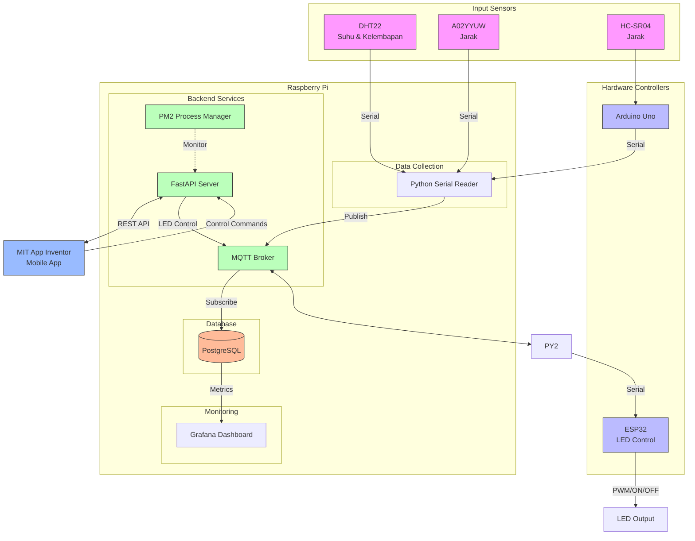

# IoT Monitoring and Control System

## Overview
This project implements an IoT-based monitoring and control system using various sensors, microcontrollers, and a Raspberry Pi as the central hub. The system collects environmental data (temperature, humidity, and distance measurements) and provides LED control capabilities through a mobile application.

## System Architecture
The system consists of several components:
Hardware Components

### Sensors:
- DHT22: Temperature and Humidity sensor
- A02YYUW: Distance sensor
- HC-SR04: Distance sensor

### Controllers:

- Arduino Uno: Interfaces with HC-SR04 sensor
- ESP32: Controls LED output via PWM/ON/OFF commands

### Central Processing:

Raspberry Pi: Acts as the main hub for data collection, processing, and storage

## IoT System Architecture Flow

### Architecture Components:

1. **Input Sensors:**
   - DHT22: Temperature and humidity sensor
   - A02YYUW: Distance sensor
   - HC-SR04: Distance sensor (connected to Arduino)

2. **Hardware Controllers:**
   - Arduino Uno: Manages HC-SR04 sensor
   - ESP32: Controls LED output

3. **Raspberry Pi System:**
   - **Data Collection:**
     - Python Serial Reader: Reads data from all sensors
   - **Backend Services:**
     - MQTT Broker: Handles pub/sub communication
     - FastAPI Server: REST API for mobile app
     - PM2: Process manager for FastAPI monitoring
   - **Storage:**
     - PostgreSQL: Stores sensor data
   - **Monitoring:**
     - Grafana: Visualization through:
       - PostgreSQL (historical data)
       - MQTT (real-time data)

4. **Mobile Application:**
   - MIT App Inventor: Interface for LED control and sensor monitoring

### Data Flow:
1. **Sensor Data Collection:**
   - DHT22 and A02YYUW directly connected to Python Serial Reader
   - HC-SR04 connected through Arduino to Python Serial Reader
   - Sensor data published to MQTT Broker

2. **Data Storage and Visualization:**
   - MQTT Broker forwards data to PostgreSQL for persistent storage
   - Grafana visualizes data from two sources:
     - PostgreSQL for historical data analysis
     - Direct MQTT subscription for real-time monitoring

3. **LED Control:**
   - Mobile app sends commands through FastAPI
   - FastAPI publishes commands to MQTT Broker
   - ESP32 subscribes to MQTT and controls LED

4. **System Monitoring:**
   - PM2 monitors FastAPI Server health
   - Grafana provides dashboards for:
     - Historical trends from PostgreSQL
     - Real-time metrics from MQTT
     - System performance metrics
