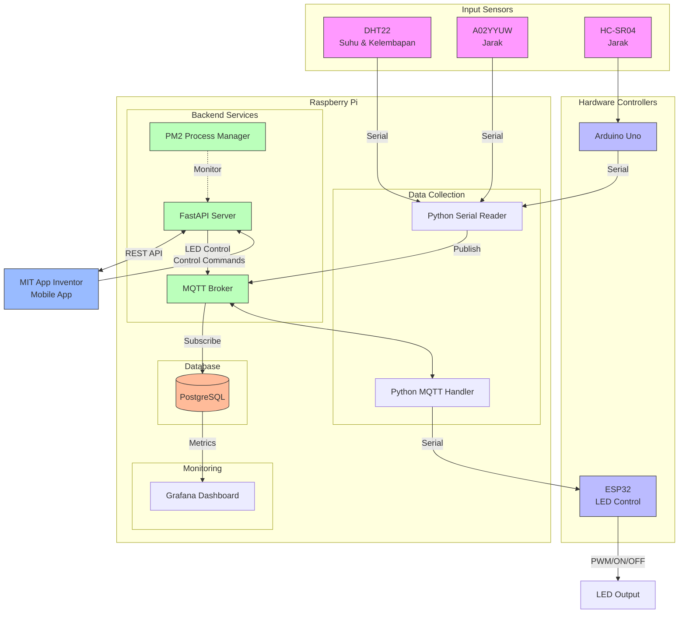

# IoT Monitoring and Control System

## Overview
This project implements an IoT-based monitoring and control system using various sensors, microcontrollers, and a Raspberry Pi as the central hub. The system collects environmental data (temperature, humidity, and distance measurements) and provides LED control capabilities through a mobile application.
System Architecture
The system consists of several components:
Hardware Components

### Sensors:
- DHT22: Temperature and Humidity sensor
- A02YYUW: Distance sensor
- HC-SR04: Distance sensor

### Controllers:

- Arduino Uno: Interfaces with HC-SR04 sensor
- ESP32: Controls LED output via PWM/ON/OFF commands

### Central Processing:

Raspberry Pi: Acts as the main hub for data collection, processing, and storage

## IoT System Architecture Flow
